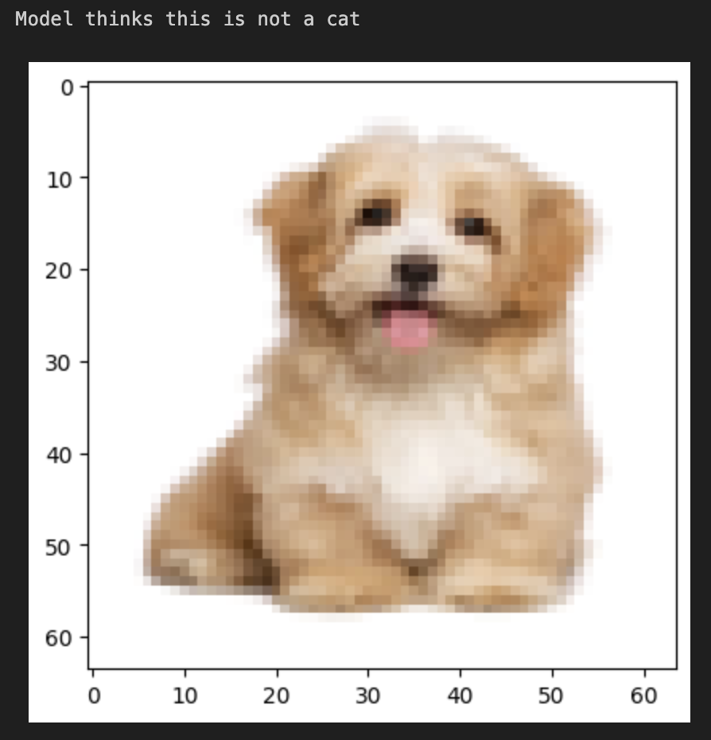
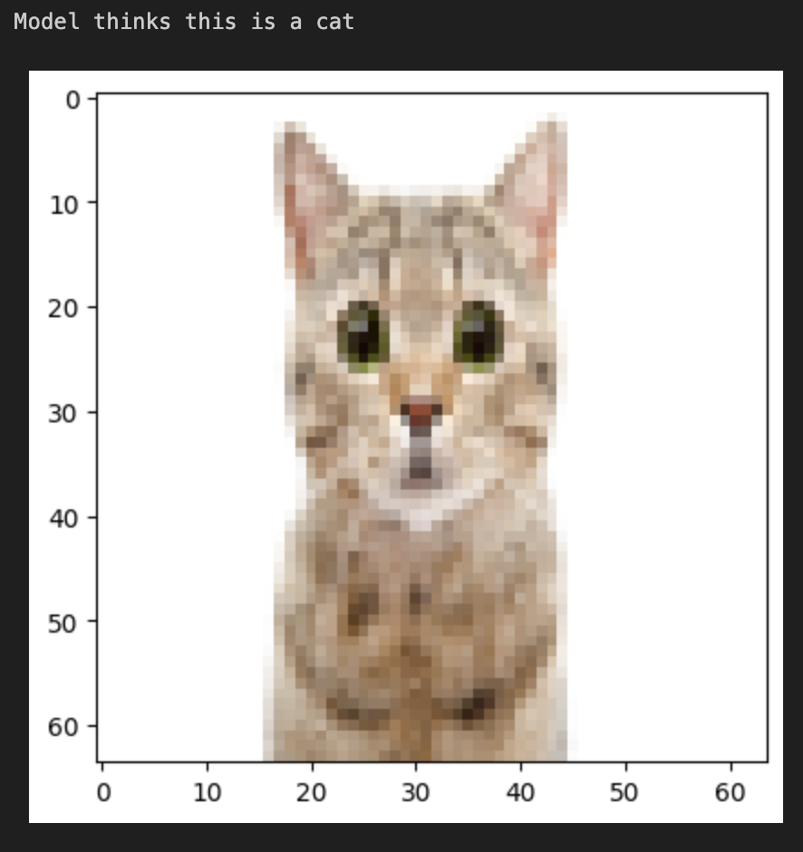

# Cat Predictor

This is a machine learning model trained to detect cats in images. We use logistic regression to train a neural network over the [catvnoncat dataset](https://www.kaggle.com/datasets/muhammeddalkran/catvnoncat).

## Sample runs

